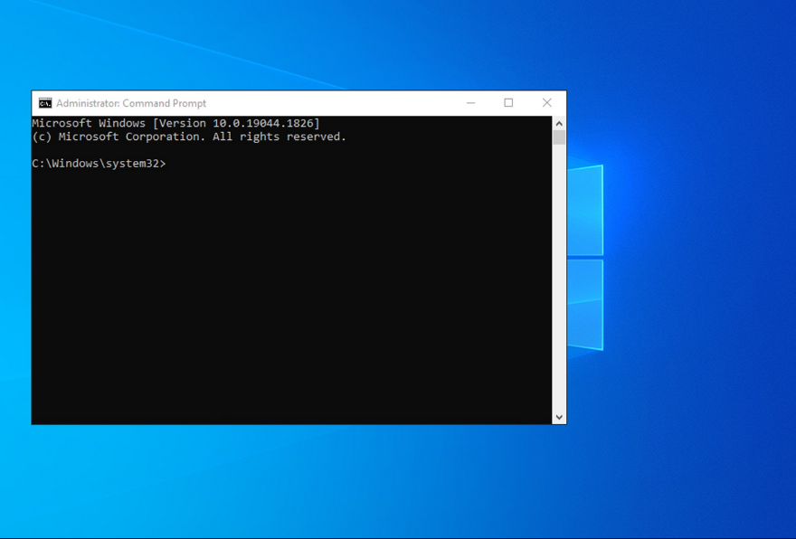
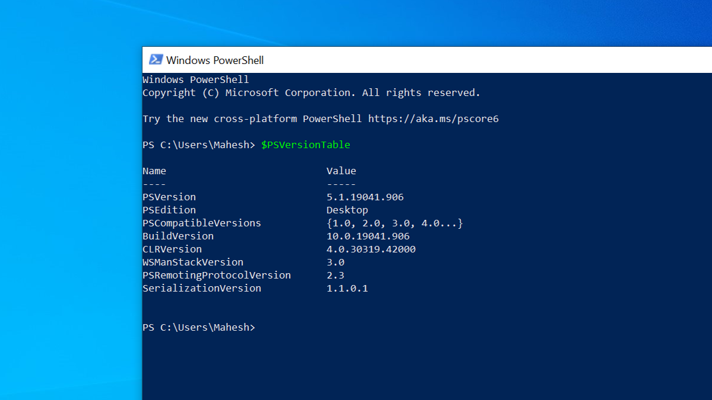
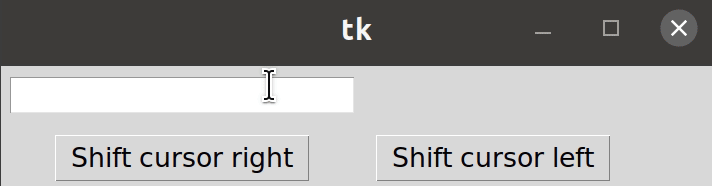
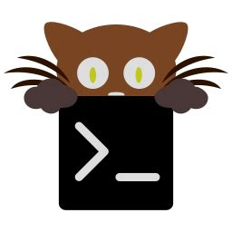
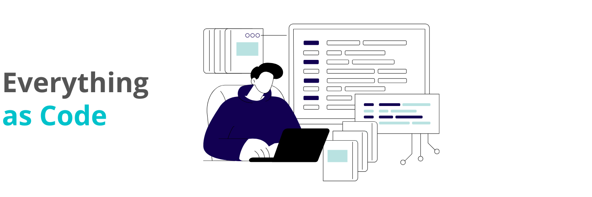
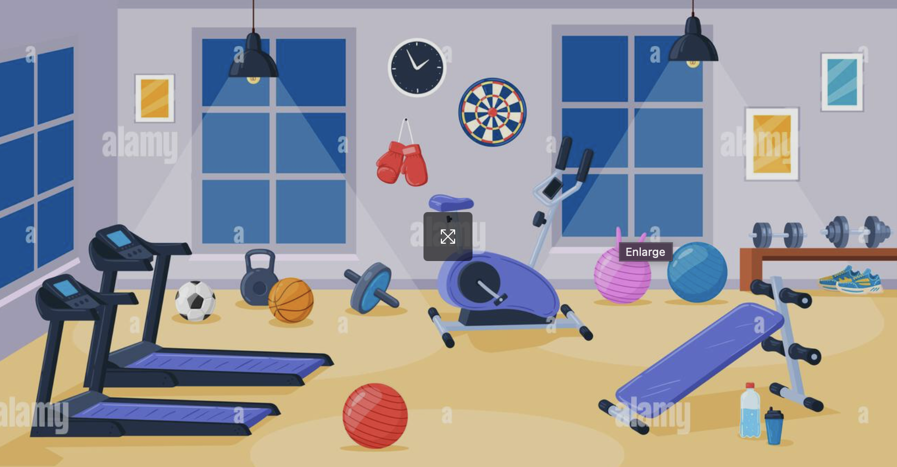
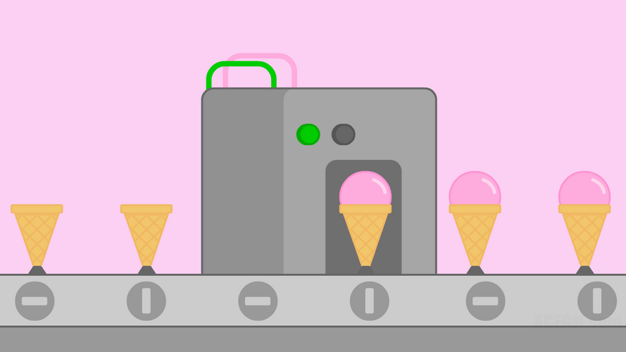
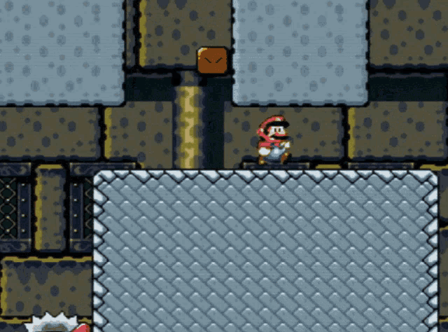
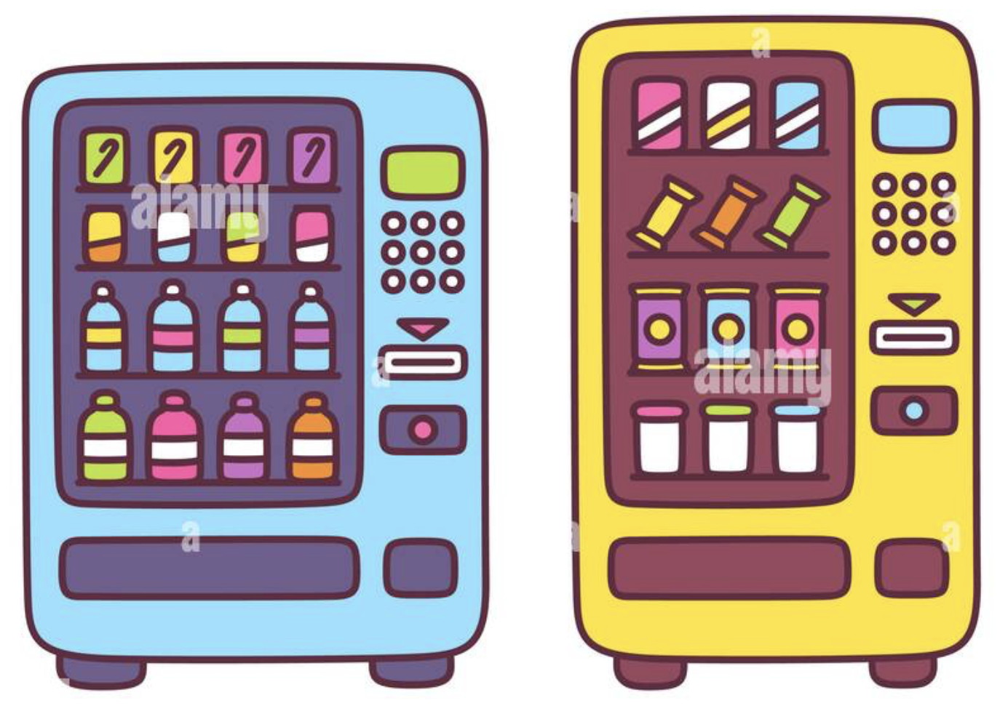

---
theme:
    override:
        code:
            #theme_name: "Monokai Extended Bright"
        default:
            colors:
                background: "10141c"
---
Service Oriented Web Applications
===
<!-- column_layout: [1,1] -->
<!-- column: 0 -->
Mitsiu Alejandro Carreño Sarabia
<!-- column: 1 -->


<!-- reset_layout -->
<!-- end_slide -->
`Agenda`    
├── Class requirements   
├── Course structure      
├── Functions        
└── Homework   

<!-- end_slide -->
<!-- jump_to_middle -->
# Class requirements
<!--end_slide -->
# Terminal mastery
The terminal window is a powerfull tool which will allow us to execute commands and programs, `you are required to learn how to use the terminal`
<!-- column_layout: [1,1] -->
<!-- column: 0 -->
CMD 

<!-- column: 1 -->
Powershell

<!-- reset_layout -->
<!-- end_slide -->

# Editor mastery
Most of our time and probably a `significant part of your professional time will be spent at your code editor,` get to know it!
<!-- column_layout: [1,1,1] -->
<!-- column: 0 -->
VsCode

<!-- column: 1 -->
Intellij

<!-- column: 2 -->
NetBeans

<!-- reset_layout -->
<!-- end_slide -->

# Editor mastery
Most of our time and probably a `significant part of your professional time will be spent at your code editor,` get to know it!

- Search in a single file
- Search in multiple files
- Know filename and file path of open file
- Go to definition
- Split screen
- Go to a specific line in a file
- Find and replace in a single/multiple files
<!-- end_slide -->

<!-- jump_to_middle -->
## Course structure   
<!-- end_slide -->
## Shared slides
All this slides will be shared, as well as source code and extra material so here's my recommendation:
- Take hand written notes in a notebook
- Write down definitions
- Write down examples or analogies which makes sense to you
- Write down your interpretation of the lecture

<!-- end_slide -->
## My setup
I personally prefer text-based rather than graphical interfaces, it's faster!
<!-- column_layout: [1,1] -->
<!-- column: 0 -->
* Mis-clicks
* Loose the cursor
* Time spent to move coursor
<!-- column: 1 -->

<!-- reset_layout -->
You can use any editor or environment which suits you, I encourage you to `learn your tools` so you can set them up for your use and confort.
<!-- end_slide -->

## My setup
But in case of wonder here's a quick overview of my setup:

<!-- column_layout: [1,1] -->
<!-- column: 0 -->
OS: MacOs (Unix based)

<!-- column: 1 -->
Terminal: Kitty (Multiplexer)
[](https://sw.kovidgoyal.net/kitty/)

<!-- reset_layout -->
<!-- end_slide -->
## My setup
But in case of wonder here's a quick overview of my setup:

<!-- column_layout: [1,2] -->
<!-- column: 0 -->
Editor: Neovim (Fast)
[](https://neovim.io/)

<!-- column: 1 -->
Slides: Presenterm (Slides as code)
[](https://github.com/mfontanini/presenterm)

<!-- reset_layout -->
<!-- end_slide -->

## Course materials
Requirements:

**Mandatory:**
- Computer
- Master your source code editor
- Commitment
- Computers ready to share screen

**Optional but recommended:**
- Physical notebooks
- Get a lot of tokens
- Disable AI assistants (copilot, chatgpt, etc)
- Disable autocompletion in your editor

<!-- end_slide -->


## Course structure **Partial test**
- `1st Partial = 30%`
- - Autoevaluation = 5%
- - Theorical evaluation = 40%
- - Practical evaluation (paper based?) = 55%
<!-- pause -->
- `2nd Partial = 30%`
- - Autoevaluation = 5%
- - Theorical evaluation = 40%
- - Practical evaluation (paper based?) = 55%
<!-- pause -->
- `3rd Partial = 40%`
- - Autoevaluation = 5%
- - Theorical evaluation = 40%
- - Practical evaluation (paper based?) = 55%
<!-- end_slide -->


## Wellness
I would like you to think of the classroom as
<!-- pause -->

<!-- pause -->
I am a guide, the effort and payback is all yours.
<!-- end_slide -->

## Wellness
I will not tolerate cheating. Evaluations are expected to be a real measurement of your knowledge.

I know this can be stressing, that's why we have tokens.

<!-- end_slide -->

## Wellness
I will giveaway `tokens` an in-class currency valued as:
<!-- alignment: center -->
1 token = 0.1 extra in your partial grade 
<!-- alignment: left -->

Tokens are earned by showing interest in the class, this broad concept can be implemented as:
<!-- pause -->
- Answering thoughtfull questions
- Asking thoughtfull questions
- Researching class-related topics
- Teaching/expaining to other classmates
- Specific in-class activities
- Showing mastery at activities
- (many more)
 
<!-- end_slide -->

## Wellness
The things you will learn in this class are important, but remember that **it's just a class**. If you're sleeping 4 hours at night, skipping meals or otherwise compromising your health for the sake of this class, **something is wrong**.

Take care of yourself if you are experiencing difficulties, dont hesitate to reach out **talk to me**. I am a **full-time professor and can find my at my cubicule.** 

Let's make a plan to help you succeed.
<!-- end_slide -->

## Course intro      
- From 0 (none) to 5 (a lot) how much do you enjoy writting code?
<!-- pause -->
- Which is the most complex program you've written?
<!-- pause -->
- Which programming languages is your favourite?
<!-- pause -->
- Do you know how to use git?
<!-- pause -->
- `Do you enjoy reading?` (Not limited to books)
<!-- pause -->
- `Do you enjoy solving problems?` (Not limited to software)
<!-- pause -->
- Did you enjoy your OOP course?
<!-- pause -->
- Did you enjoy your Web Apps & Mobile Dev course?
<!-- end_slide -->

## Course intro      
My class is an spiritual successor of Web Application & Mobile development class.

<!-- pause --> 
So show me what you achieved in it!
<!-- end_slide -->
<!-- jump_to_middle -->
### Diagnostic Evaluation
- Piece of paper
- Name it
<!-- end_slide -->

### Diagnostic Evaluation
1. Para qué sirve un tipo de dato
2. Ejemplifica 3 tipos de datos de cualquier lenguaje de programación
3. Para qué sirve una función
4. Ejemplifica una definición de función en cualquier lenguaje de programación
5. Para qué sirve un parámetro en una función
6. Cuál es la diferencia entre definir una función e invocar/aplicar una función
7. Para qué sirve una clase en el paradigma de programación orientado a objetos
8. Cuál es la diferencia entre definir una clase e instanciar un objeto
9. Ejemplifica definir una clase en cualquier lenguaje de programación orientado a objetos.
10. Ejemplifica instanciar un objeto en cualquier lenguaje de programación orientado a objetos.


<!-- end_slide -->

#### Functions
What does the following code does?
```javascript
function square(number) {
  return number * number;
}
```

What is a function?
<!-- pause -->
> a set of statements that performs a task or calculates a value, it should take some input and return an output where there is some obvious relationship between the input and the output.

Mozilla Developer Network

<!-- end_slide -->

#### Functions
What is a function?
> a set of statements that performs a task or calculates a value, it should take some input and return an output where there is some obvious relationship between the input and the output.

Mozilla Developer Network


<!-- end_slide -->

#### Functions
What does the following code does?
```javascript
function square(number) {
  return number * number;
}
```

<!-- end_slide -->

#### Functions
```javascript
function square(number) {
  return number * number;
}
```
A function consists of the function keyword, followed by:

- The name of the function `square`
- A list of parameters to the function, enclosed in parentheses and separated by commas `number`
- The JavaScript statements that define the function, enclosed in curly braces, { /* … */ }. `return number * number`
<!-- end_slide -->

#### Functions
```javascript
// Help me define a function that given a number, outputs the number by two
```
A function consists of the function keyword, followed by:

- The name of the function `square`
- A list of parameters to the function, enclosed in parentheses and separated by commas `number`
- The JavaScript statements that define the function, enclosed in curly braces, { /* … */ }. `return number * number`
<!-- end_slide -->

#### Functions
```javascript
// Help me define a function that given an non-empty array returns the first element
```
A function consists of the function keyword, followed by:

- The name of the function `square`
- A list of parameters to the function, enclosed in parentheses and separated by commas `number`
- The JavaScript statements that define the function, enclosed in curly braces, { /* … */ }. `return number * number`
<!-- end_slide -->

#### Functions
```javascript
// Help me define a function that tells true if a string is "programming" 
```
A function consists of the function keyword, followed by:

- The name of the function `square`
- A list of parameters to the function, enclosed in parentheses and separated by commas `number`
- The JavaScript statements that define the function, enclosed in curly braces, { /* … */ }. `return number * number`
<!-- end_slide -->

#### Functions
```javascript
function square(number) {
  return number * number;
}
```
Defining a function is building the machine


<!-- end_slide -->
#### Functions
How do we use the machine?


Notice at this point the machine is completed.

<!-- pause -->
```javascript
square(5);
```

We provide an input

<!-- end_slide -->

#### Functions
1. We define a function (create a machine)
```javascript
function square(number) {
  return number * number;
}
```
2. We invoke/apply the function
```javascript
square(5);
```
<!-- end_slide -->

#### Functions
Let's try our functions in our computer
1. Open your browser
2. Access the development tools
3. Select `console` tab
4. Define and invoke our functions 
<!-- end_slide -->

<!-- jump_to_middle -->

##### Play/Explore
<!-- end_slide -->

##### Play/Explore
What do you do in this kind of situations?

<!-- end_slide -->

##### Play/Explore
- square function
1. What happens if we send a character?
2. What happens if we send a negative number?
3. What happens if we send a decimal number?
4. What happens if we send a really really really big number?
- byTwo
1. What happens if we send a character?
2. What happens if we send a negative number?
3. What happens if we send a decimal number?
4. What happens if we send a really really big number?
5. Does it behave differently than square?
<!-- end_slide -->

##### Play/Explore
- first
1. What happens if we send a number?
2. What happens if we send a word?
3. What happens if we send an array of booleans?
4. What happens if we send an empty array?
5. What happens if we send no parameter?
- isProgramming
1. What happens if we send "PROGRAMMING"?
2. What happens if we send "Programming"?
3. What happens if we send "programmin g"?
4. What happens if we send a number?
5. What happens if we send a boolean?
<!-- end_slide -->


#### Functions and parameters
```javascript
// Help me define a function that adds five numbers
```
A function consists of the function keyword, followed by:

- The name of the function `adder`
- A list of parameters to the function, enclosed in parentheses and separated by commas `num1, num2, num3, num4, num5`
- The JavaScript statements that define the function, enclosed in curly braces, { /* … */ }. `return num1 + num2 + num3 + num4 + num5`
<!-- end_slide -->

##### Play/Explore
- adder
1. What happens if we name all the parameters num?
2. What happens if we only provide 4 parameters?
3. What happens if we provide 5 strings?
4. What happens if we provide 5 booleans?
5. What happens if we mix 3 numbers with 2 strings?
<!-- end_slide -->

#### Productive functions
```javascript
// Help me define a function that greet people returning "Hola Rafael" or "Hola Diana" for any given name
```
A function consists of the function keyword, followed by:

- The name of the function
- A list of parameters to the function, enclosed in parentheses and separated by commas
- The JavaScript statements that define the function, enclosed in curly braces, { /* … */ }. `return "Hola" + algunNombre`
<!-- end_slide -->

#### Productive functions
```javascript
// Help me define a function that returns if a given number is odd or even.
```
A function consists of the function keyword, followed by:

- The name of the function
- A list of parameters to the function, enclosed in parentheses and separated by commas
- The JavaScript statements that define the function, enclosed in curly braces, { /* … */ }.
`if (input % 2 == 0) { ... }else{ ... }` 
<!-- end_slide -->


#### Productive functions
```javascript
// Help me define a function that returns the greater given two numbers
```
A function consists of the function keyword, followed by:

- The name of the function
- A list of parameters to the function, enclosed in parentheses and separated by commas
- The JavaScript statements that define the function, enclosed in curly braces, { /* … */ }.
<!-- end_slide -->


<!-- jump_to_middle -->
###### Functions Describe the world
https://www.youtube.com/watch?v=zHU1xH6Ogs4
<!-- end_slide -->
###### Functions Describe the world
What's the input/output?
<!-- column_layout: [1,1,1] -->
<!-- column: 0 -->

<!-- column: 1 -->

<!-- column: 2 -->

<!-- end_slide -->

###### Functions Describe the world
Let's focus on this animation:
<!-- column_layout: [1,2] -->
<!-- column: 0 -->

<!-- column: 1 -->
- How many machines are in this animation?
- How can we translate this animation into functions?
<!-- end_slide -->

<!-- jump_to_middle -->
###### Homework
<!-- end_slide -->

###### Homework
**1. Bring your computer next session**       
<!-- pause -->
**2. Master your terminal:**
- `cd <path>` Change to a specific directory
- `cd ..` Go to parent directory 
- `pwd` Print current directory 
<!-- pause -->
**3. Master your code editor:**
<!-- column_layout: [1,1] -->
<!-- column: 0 -->
- Search in a single file
- Search in multiple files
- Know filename and file path of open file
- Go to definition
<!-- column: 1 -->
- Split screen
- Go to a specific line in a file
- Find and replace in a single/multiple files
<!-- reset_layout -->
<!-- end_slide -->

###### Homework
**4. Master your keyword**
- How to keypress () [] {}
- https://monkeytype.com/
- Practice PascalCase with shift key

**5. Upskill your english**
