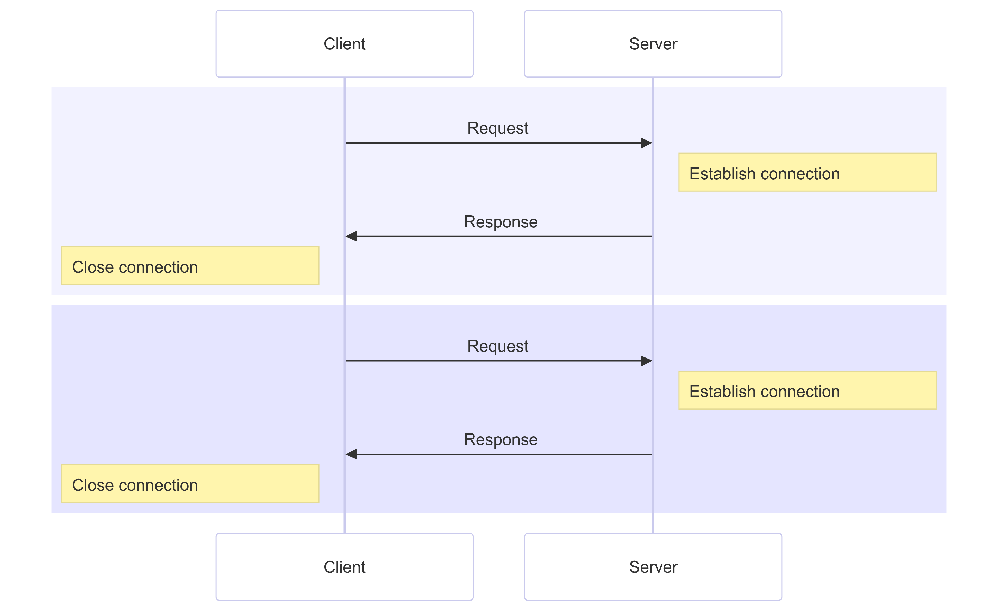
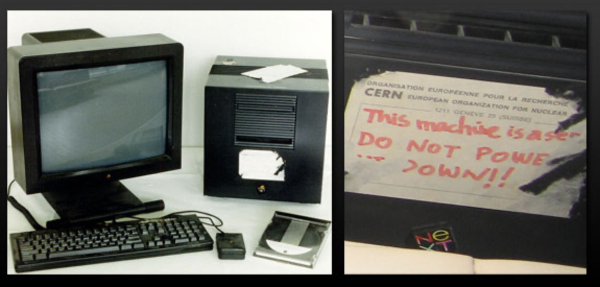
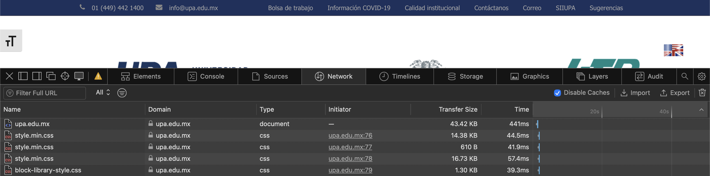
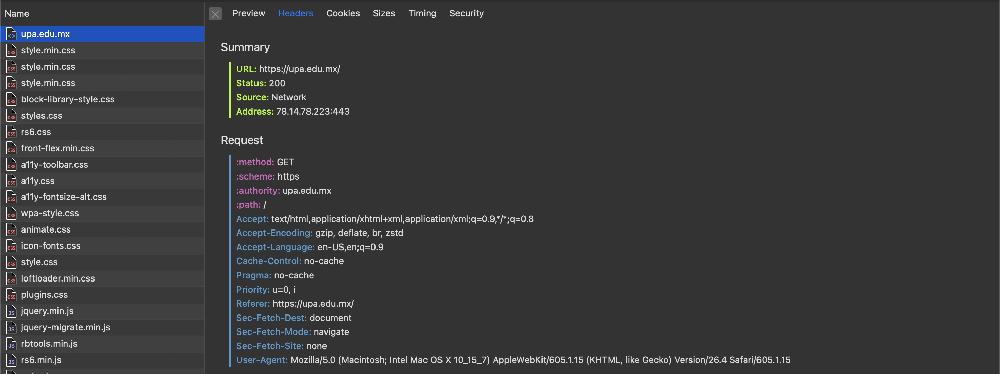
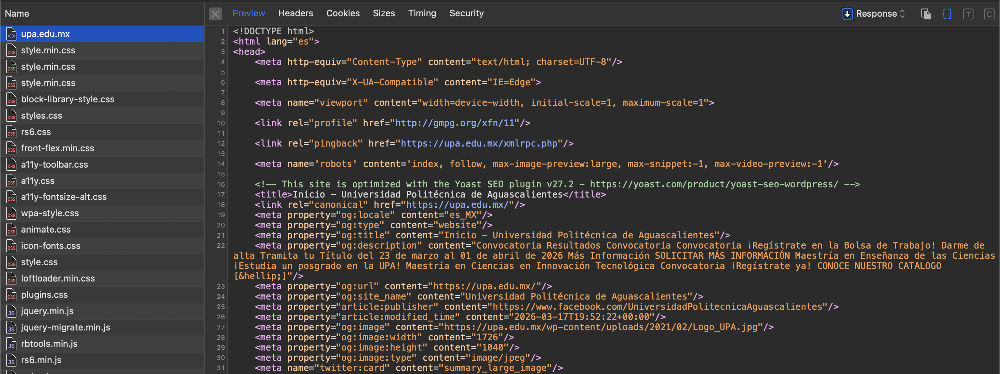
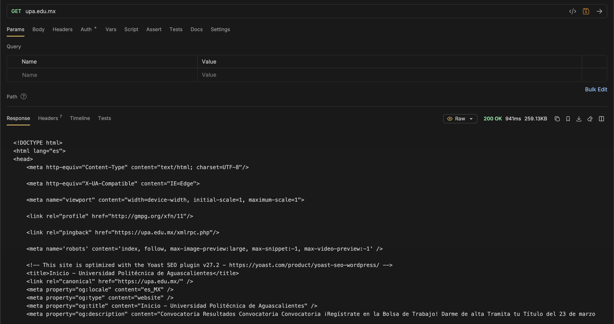

---
theme:
    override:
        code:
            #theme_name: "Monokai Extended Bright"
        default:
            colors:
                background: "10141c"
---
Client-Server Arquitecture
===
<!-- column_layout: [1,1] -->
<!-- column: 0 -->
Mitsiu Alejandro Carreño Sarabia
<!-- column: 1 -->

<!-- reset_layout -->
<!-- end_slide -->

# Course structure **Partial test**
- `1st Partial = 30%`
- - Autoevaluation = 5%
- - Theorical evaluation = 40%
- - Practical evaluation (paper based?) = 55%
<!-- end_slide -->

`Agenda`    
├── Client-Server Arquitecture   
├── Clients      
├── Servers        
├── Hand's on exploration        
└── Homework   

<!-- end_slide -->

<!-- jump_to_middle -->
# Client-Server Arquitecture
<!--end_slide -->
# Client-Server Arquitecture
<!-- column_layout: [1,1] -->
<!-- column: 0 -->
What is a server?     
Let's begin with the real world.

<!-- column: 1 -->
<!-- pause -->
> Those who work at a restaurant or a bar attending customers and supplying them with food and drink as requested.

Server as a role (Wikipedia)
<!-- reset_layout -->
<!-- end_slide -->

# Client-Server Arquitecture
<!-- column_layout: [1,2] -->
<!-- column: 0 -->
How do we interact with this kind of server?

<!-- column: 1 -->
1. A customer enter the establishment.
<!-- pause -->
2. The customer tells the server what he/she wants to `request`. 
<!-- pause -->
3. The server goes on to fullfill the `request`.
<!-- pause -->
4. Later the server returns with the customer `response`.
<!-- end_slide -->

# Client-Server Arquitecture
Does this diagram reflect this interaction between customers and servers?

<!-- end_slide -->

# Client-Server Arquitecture
We can stop thinking about people and replace them with devices:

<!-- end_slide -->

## Clients
A client is a program that, as part of its operation, relies on sending a request to a service made available by a server.

The easiest example I can think of is your web browser.
But there are a lot other client examples:
- Videogame clients
- Email clients
- Streaming clients
- Weather clients
<!-- end_slide -->

### Servers
A server is a computer or software system that provides data, resources, or services to other computers called "clients" on a computer network.

Without servers, the clients don't have the data to display.

<!-- end_slide -->

### Servers
What are the benefits of a model like this?

<!-- end_slide -->

### Servers
<!-- column_layout: [1,1] -->
<!-- column: 0 -->
Clients:
- Lightweight
- Can be replaced without impacting data access
- Just ask the information it needs
<!-- column: 1 -->
Servers:
- Store state (single source of truth)
- Can handle multiple clients at the same time
- Responsible for authentication (who is the client) and authorization (what can the client access)

<!-- end_slide -->
 
### Servers
Servers tend to have this ominous image but that's just for relaibility purposes.

<!-- end_slide -->

#### Hand's on exploration
Open your browser (web client) and navigate to:

Open your developer tools on network tab

<!-- end_slide -->

#### Hand's on exploration
Each row is a request, we can analize each:

<!-- end_slide -->

#### Hand's on exploration
Each row is a request, we can analize each:

<!-- end_slide -->

#### Hand's on exploration
But how does our browser knows to request all those resources?

<!-- end_slide -->

#### Hand's on exploration
But how does our browser knows to request all those resources?

<!-- end_slide -->

#### Hand's on exploration
Let's use a different kind of web client:
<!-- column_layout: [1,1,1] -->
<!-- column: 0 -->

<!-- column: 1 -->

<!-- column: 2 -->

<!-- end_slide -->

#### Hand's on exploration

<!-- end_slide -->

#### Hand's on exploration
Let's try different content types:
- upa.edu.mx
- upa.edu.mx/wp-content/uploads/2024/03/banner-sitio-UPA_veda.png
- upa.edu.mx/wp-includes/css/dist/preferences/style.min.css?ver=6.9.4
- upa.edu.mx/wp-content/plugins/loftloader/assets/js/loftloader.min.js?ver=2025121501
<!-- end_slide -->

##### Homework
Try and recreate more requests from different sites in postman

