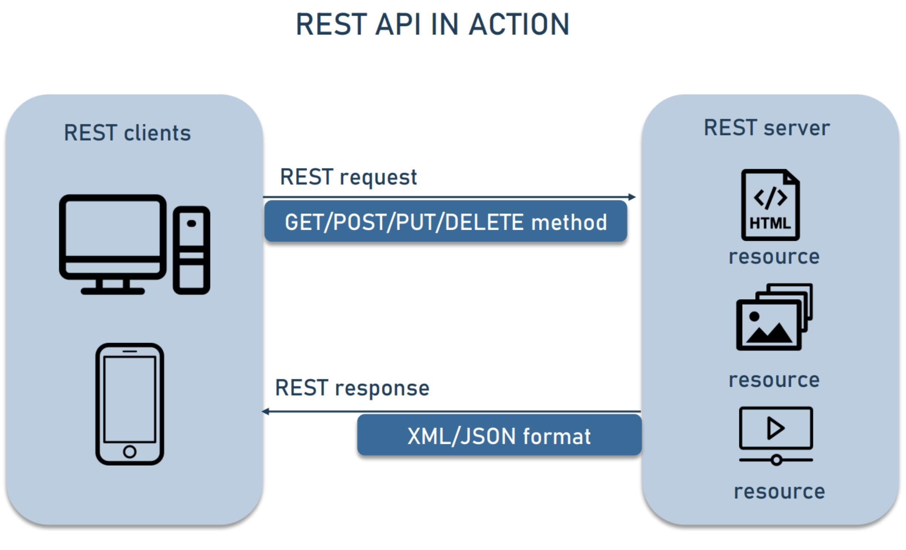
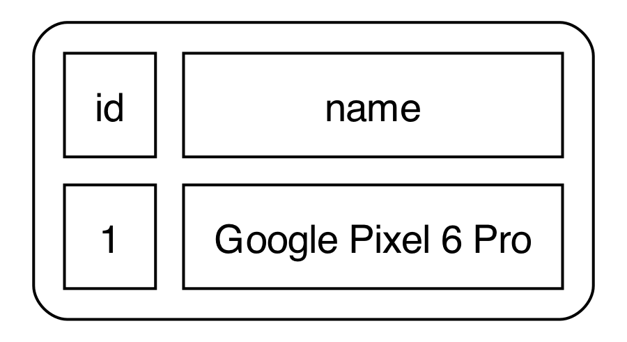
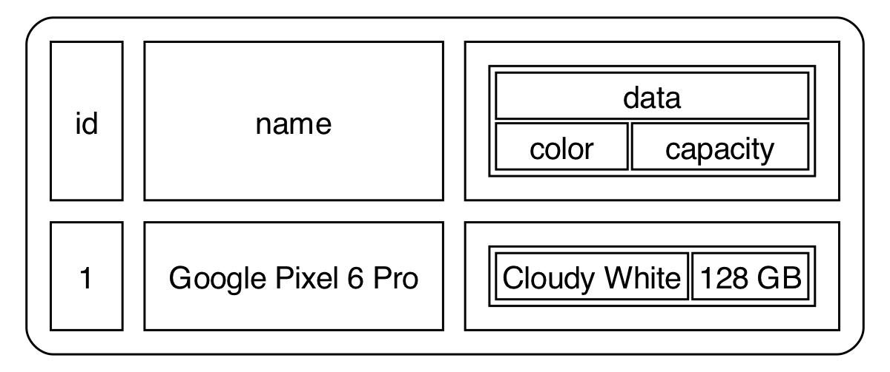
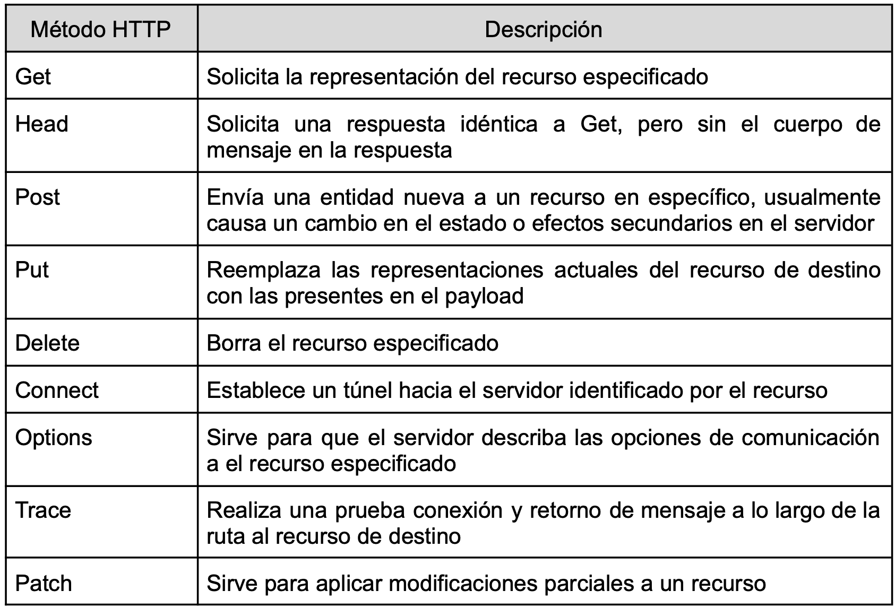
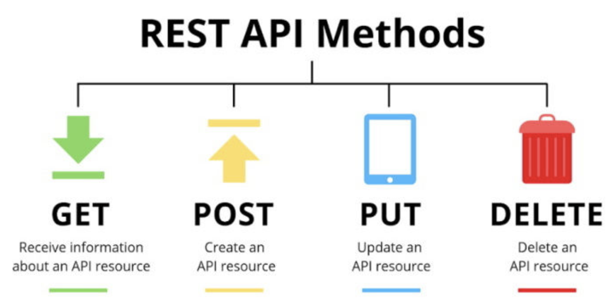
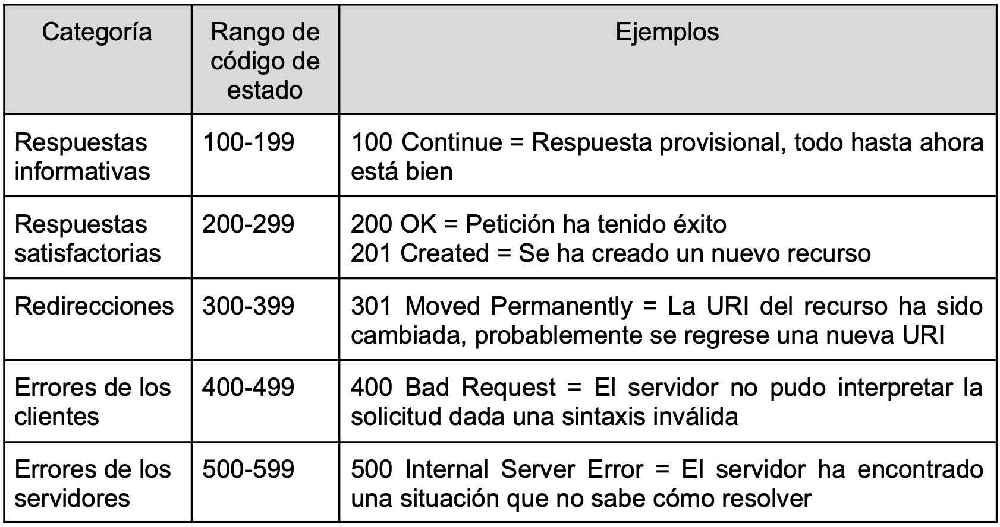
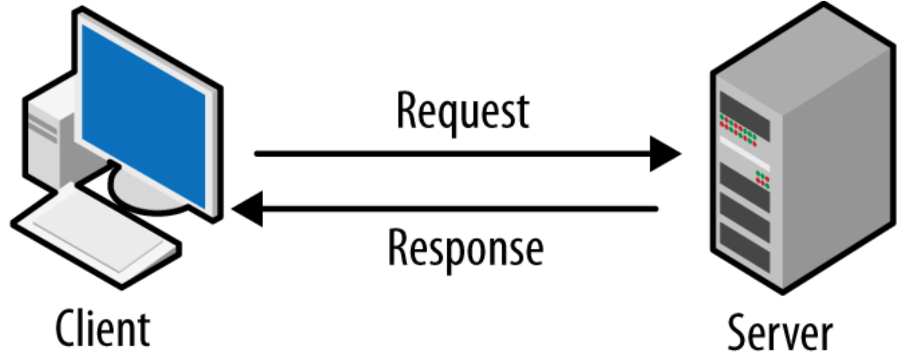
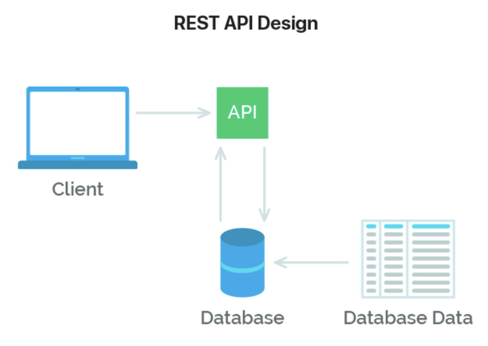

---
theme:
    override:
        code:
            #theme_name: "Monokai Extended Bright"
        default:
            colors:
                background: "10141c"
---
Restfull api
===
<!-- column_layout: [1,1] -->
<!-- column: 0 -->
Mitsiu Alejandro Carreño Sarabia
<!-- column: 1 -->


<!-- reset_layout -->
<!-- end_slide -->

# Course structure **Partial test**
- `1st Partial = 30%`
- - Autoevaluation = 5%
- - Theorical evaluation = 40%
- - Practical evaluation (paper based?) = 55%
<!-- end_slide -->

`Agenda`    
├── Json   
├── Http Methods      
├── Http Status        
├── RestAPI and state        
└── Homework   

<!-- end_slide -->

# Intro
Let's use bruno or postman to call this url:
[](https://api.restful-api.dev/objects)
<!-- end_slide -->

# Intro
What does the response mean?
```json
[
  {
    "id": "1",
    "name": "Google Pixel 6 Pro",
    "data": {
      "color": "Cloudy White",
      "capacity": "128 GB"
    }
  }, {...}
]
```
<!-- end_slide -->

# JSON
<!-- column_layout: [1,1] -->
<!-- column: 0 -->
What does the response mean?
```json
[
  {
    ...
  },
  {
    ...
  },
  {
    ...
  }
]
```

<!-- column: 1 -->
What does this structure looks like?

Also how  `[]` is interpreted in javascript? 
<!-- pause -->


It's a list (array)
<!-- end_slide -->

# JSON
<!-- column_layout: [2,1] -->
<!-- column: 0 -->
Let's analize a single entry in our list
```json
{
  "id": "1",
  "name": "Google Pixel 6 Pro",
  "data": {
    "color": "Cloudy White",
    "capacity": "128 GB"
  }
}
```
<!-- column: 1 -->
What does this text mean?

Maybe we need to zoom in a little more
<!-- end_slide -->

# JSON
<!-- column_layout: [1,1] -->
<!-- column: 0 -->
Maybe we need to zoom in a little more
```json
{
  "id": "1",
  ...
}
```
<!-- column: 1 -->
What does this text mean?

It follows the format:
"key": "value"
<!-- end_slide -->

# JSON
It follows the format:
"key": "value"
```json
{
  "id": "1",
  "name": "Google Pixel 6 Pro",
  ...
}
```
We can even draw a table based on it:

<!-- end_slide -->

# JSON
It follows the format:
"key": "value"
```json
{
  "id": "1",
  "name": "Google Pixel 6 Pro",
  ...
}
```
So what are the `{}` enclosing?
<!-- pause -->
A cellphone info
<!-- end_slide -->

# JSON Things can get ~~strage~~ recursive
```json
{
  "id": "1",
  "name": "Google Pixel 6 Pro",
  "data": {
    "color": "Cloudy White",
    "capacity": "128 GB"
  }
}
```

<!-- end_slide -->

## Rest api methods
Let's keep exploring all the endpoints in:
[](https://restful-api.dev)



<!-- end_slide -->
## Rest api methods
Here's a less technical overview of the most important methods


<!-- end_slide -->
## Rest api http codes
Let's keep exploring all the endpoints in:
[](https://restful-api.dev)


<!-- end_slide -->

### Homework
Find sites that use multiple http methods
<!-- end_slide -->
<!-- jump_to_middle -->
#### RestAPI and state
<!-- end_slide -->

#### RestAPI and state
Previously we modeled our arquitecture with two entities:

<!-- pause -->
But how can a database be added into our model?
<!-- end_slide -->


#### RestAPI and state
With this model we isolate our database access to a single entity.     
Clients do not need to know about the database directly, `mitigating access control problems`

