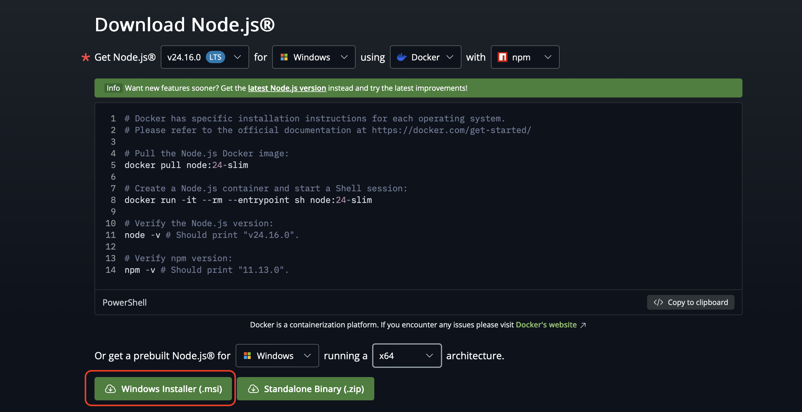

---
theme:
    override:
        code:
            #theme_name: "Monokai Extended Bright"
        default:
            colors:
                background: "10141c"
---
NestJs
===
<!-- column_layout: [1,1] -->
<!-- column: 0 -->
Mitsiu Alejandro Carreño Sarabia
<!-- column: 1 -->

<!-- reset_layout -->
<!-- end_slide -->

# Course structure **Partial test**
- `2nd Partial = 30%`
- - Autoevaluation = 5%
- - Theorical evaluation = 40%
- - Practical evaluation = 55%
<!-- end_slide -->

`Agenda`    
├── Requirements   
├── Installation      
├── Code execution        
└── Code exploration   

<!-- end_slide -->

# Requirements
Install node (https://nodejs.org/en/download)

\* You can use docker if you know how to use it.
<!-- end_slide -->

# Requirements
Confirm installation with the commands:
```bash
node --version
npm --version
```
<!-- end_slide -->

## Installation
We are going to use nestJs framework to develop our API's
```bash
npm install -g @nestjs/cli
nest new Ex3-nestjs-intro

# Alternatively
npx @nestjs/cli new Ex3-nestjs-intro
```
You can use either npm or yarn (if installed)
```bash
? Which package manager would you ❤️  to use?
❯ npm
  yarn
  pnpm
```
<!-- end_slide -->

### Code execution
How do we run our application?
```bash
✔ Installation in progress... ☕

🚀  Successfully created project ex3-nestjs-intro
👉  Get started with the following commands:

$ cd ex3-nestjs-intro
$ npm run start

                                         
         Thanks for installing Nest 🙏
Please consider donating to our open collective
       to help us maintain this package.
                                  
                                  
🍷  Donate: https://opencollective.com/nest

```
<!-- end_slide -->

### Code execution
How do we run our application?
```bash {6-7}
✔ Installation in progress... ☕

🚀  Successfully created project ex3-nestjs-intro
👉  Get started with the following commands:

$ cd ex3-nestjs-intro   👈👈👈👈
$ npm run start        👈👈👈👈

                                         
         Thanks for installing Nest 🙏
Please consider donating to our open collective
       to help us maintain this package.
                                  
                                  
🍷  Donate: https://opencollective.com/nest

```
<!-- end_slide -->

### Code execution
We can see the following logs:
```bash
$ nest start
[Nest] 33992  - LOG [NestFactory] Starting Nest application...
[Nest] 33992  - LOG [InstanceLoader] AppModule dependencies initialized +3ms
[Nest] 33992  - LOG [RoutesResolver] AppController {/}: +1ms
[Nest] 33992  - LOG [RouterExplorer] Mapped {/, GET} route +1ms
[Nest] 33992  - LOG [NestApplication] Nest application successfully started +0ms
```

Based on them how do we access our api from the browser and postman/bruno?
<!-- end_slide -->

### Code execution
Little pro tip:
```bash
npm run start:dev 
```
;)
<!-- end_slide -->

#### Code exploration
Let's dig deeper into what did this command do?
```bash
nest new Ex3-nestjs-intro
```

- What's the new folder name?
<!-- pause -->
```bash
ex3-nestjs-intro
├── dist
├── eslint.config.mjs
├── nest-cli.json
├── node_modules
├── package.json
├── README.md
├── src
├── test
├── tsconfig.build.json
├── tsconfig.json
└── yarn.lock
```
<!-- end_slide -->
#### Code exploration
Node modules and a few other boilerplate files will be installed, and a src/ directory will be created and populated with `several core files`.
```bash
src
├── app.controller.spec.ts
├── app.controller.ts
├── app.module.ts
├── app.service.ts
└── main.ts
```
<!-- end_slide -->

#### Code exploration
| File | Description |
|:---:|---|
| app.controller.ts | A basic controller with a single route. |
| app.controller.spec.ts | The unit tests for the controller. |
| app.module.ts | The root module of the application. |
| app.service.ts | A basic service with a single method. |
| main.ts | The entryfile create a Nest app instance|

<!-- new_line -->
<!-- new_line -->
<!-- new_line -->
That's a lot of buzzwords let's start with the part we are already familiar...
<!-- end_slide -->

#### Code exploration
Let's begin with the file `src/app.controller.ts`:
> A basic controller with a single route.
```ts +line_numbers
import { Controller, Get } from '@nestjs/common';
import { AppService } from './app.service';

@Controller()
export class AppController {
  constructor(private readonly appService: AppService) {}

  @Get()
  getHello(): string {
    return this.appService.getHello();
  }
}
```
<!-- end_slide -->

#### Code exploration
```ts +line_numbers {5,12}
import { Controller, Get } from '@nestjs/common';
import { AppService } from './app.service';

@Controller()
export class AppController {
  constructor(private readonly appService: AppService) {}

  @Get()
  getHello(): string {
    return this.appService.getHello();
  }
}
```
<!-- pause -->
`export` allow to use the class in other files
<!-- end_slide -->

#### Code exploration
```ts +line_numbers {5,9,11-12}
import { Controller, Get } from '@nestjs/common';
import { AppService } from './app.service';

@Controller()
export class AppController {
  constructor(private readonly appService: AppService) {}

  @Get()
  getHello(): string {
    return this.appService.getHello();
  }
}
```
<!-- pause -->
`<function>(): <type>` express the function return data type 
<!-- end_slide -->

#### Code exploration
```ts +line_numbers {5,6,12}
import { Controller, Get } from '@nestjs/common';
import { AppService } from './app.service';

@Controller()
export class AppController {
  constructor(private readonly appService: AppService) {}

  @Get()
  getHello(): string {
    return this.appService.getHello();
  }
}
```
<!-- pause -->
`private` only within the class can be accessed     
`readonly` prevents modification of that property after initialization     
`<variable>:<type>` in this context (not JSON) a variable has type 
<!-- end_slide -->

#### Code exploration
```ts +line_numbers {5-7,9-12}
import { Controller, Get } from '@nestjs/common';
import { AppService } from './app.service';

@Controller()
export class AppController {
  constructor(private readonly appService: AppService) {}

  @Get()
  getHello(): string {
    return this.appService.getHello();
  }
}
```
<!-- pause -->
The class AppController has a method getHello
The class AppController has a constructor that initialize appService
The method getHello uses the class atribute appService via `this`
<!-- end_slide -->

#### Code exploration
```ts +line_numbers {6,10}
import { Controller, Get } from '@nestjs/common';
import { AppService } from './app.service';

@Controller()
export class AppController {
  constructor(private readonly appService: AppService) {}

  @Get()
  getHello(): string {
    return this.appService.getHello();
  }
}
```
1. What is appService an instance or class?
<!-- pause -->
Instance (Line 6 `appService: AppService`)     
<!-- end_slide -->

#### Code exploration
```ts +line_numbers {6,10}
import { Controller, Get } from '@nestjs/common';
import { AppService } from './app.service';

@Controller()
export class AppController {
  constructor(private readonly appService: AppService) {}

  @Get()
  getHello(): string {
    return this.appService.getHello();
  }
}
```
2. Which class does it derive from?
<!-- pause -->
From AppService (Line 6 `appService: AppService`)
<!-- end_slide -->

#### Code exploration
```ts +line_numbers {6,10}
import { Controller, Get } from '@nestjs/common';
import { AppService } from './app.service';

@Controller()
export class AppController {
  constructor(private readonly appService: AppService) {}

  @Get()
  getHello(): string {
    return this.appService.getHello();
  }
}
```
3. Which method does AppService has?
<!-- pause -->
getHello (Line 10 `appService.getHello()`)
<!-- end_slide -->

#### Code exploration
```ts +line_numbers {6,10}
import { Controller, Get } from '@nestjs/common';
import { AppService } from './app.service';

@Controller()
export class AppController {
  constructor(private readonly appService: AppService) {}

  @Get()
  getHello(): string {
    return this.appService.getHello();
  }
}
```
4. How do we know appService.getHello is a method and not an attribute?
<!-- pause -->
Parenthesis means a function invocation
<!-- end_slide -->

#### Code exploration
```ts +line_numbers {6,9-11}
import { Controller, Get } from '@nestjs/common';
import { AppService } from './app.service';

@Controller()
export class AppController {
  constructor(private readonly appService: AppService) {}

  @Get()
  getHello(): string {
    return this.appService.getHello();
  }
}
```
5. Which data type does appService.getHello() returns?
<!-- pause -->
String, getHello result is directly returned by AppController.getHello
(Line 9 `getHello(): string`)
<!-- end_slide -->

#### Code exploration
```ts +line_numbers {8}
import { Controller, Get } from '@nestjs/common';
import { AppService } from './app.service';

@Controller()
export class AppController {
  constructor(private readonly appService: AppService) {}

  @Get()
  getHello(): string {
    return this.appService.getHello();
  }
}
```
6. Finally even if we don't understand the notation what does Line 8 do?
<!-- pause -->
It linkes the method getHello (Line 9) to the request method `Get` 
<!-- end_slide -->

#### Code exploration
```ts +line_numbers {8}
import { Controller, Get } from '@nestjs/common';
import { AppService } from './app.service';

@Controller()
export class AppController {
  constructor(private readonly appService: AppService) {}

  @Get()
  getHello(): string {
    return this.appService.getHello();
  }
}
```
`@<Name>` are called Decorators it allows to expand the properties of classes, methods, even parameters      
7. Which type of decorator is `@Get`?
<!-- pause -->
It's a method decorator, affecting the behaviour of getHello()
<!-- end_slide -->

#### Code exploration
```ts +line_numbers {10}
import { Controller, Get } from '@nestjs/common';
import { AppService } from './app.service';

@Controller()
export class AppController {
  constructor(private readonly appService: AppService) {}

  @Get()
  getHello(): string {
    return this.appService.getHello();
  }
}
```
8. Given that we know that getHello method handles our request and the responses we get on postman, what must be the result of this.appService.getHello();
<!-- pause -->
`Hello World!` which end up being the response body
<!-- end_slide -->

#### Code exploration
```ts +line_numbers {2}
import { Controller, Get } from '@nestjs/common';
import { AppService } from './app.service';

@Controller()
export class AppController {
  constructor(private readonly appService: AppService) {}

  @Get()
  getHello(): string {
    return this.appService.getHello();
  }
}
```
9. Where is located the definition of AppService?
<!-- pause -->
`src/app.service.ts`
<!-- end_slide -->

#### Code exploration
> A basic controller with a single route.
```ts +line_numbers {2,6,10}
import { Controller, Get } from '@nestjs/common';
import { AppService } from './app.service';

@Controller()
export class AppController {
  constructor(private readonly appService: AppService) {}

  @Get()
  getHello(): string {
    return this.appService.getHello();
  }
}
```
Let's try to draft our own version of the service!
<!-- pause -->
<!-- end_slide -->

#### Code exploration
`src/app.service.ts`
> A basic service with a single method.
```ts
import { Injectable } from '@nestjs/common';

@Injectable()
export class AppService {
  getHello(): string {
    return 'Hello World!';
  }
}
``` 
<!-- end_slide -->

#### Code exploration
`src/app.service.ts`
> A basic service with a single method.
```ts +line_numbers {4}
import { Injectable } from '@nestjs/common';

@Injectable()
export class AppService {
  getHello(): string {
    return 'Hello World!';
  }
}
``` 
What does `export` do?
<!-- pause -->
`export` allow to use the class in other files
<!-- end_slide -->

#### Code exploration
`src/app.service.ts`
> A basic service with a single method.
```ts +line_numbers {5-7}
import { Injectable } from '@nestjs/common';

@Injectable()
export class AppService {
  getHello(): string {
    return 'Hello World!';
  }
}
``` 
What does `getHello(): string {...}` mean?
<!-- pause -->
`getHello` is the method name     
`()` doesnt receive parameters     
`: string` the method returns a string 
<!-- end_slide -->

#### Code exploration
- Controllers (`app.controller.ts`) == Access Layer
- - Receive and handle client requests, defining http methods, and resource path's
<!-- new_line -->
- Services (`app.service.ts`) == Process/Service Layer
- - Define business logic by orquestrating reutilizable processes
<!-- end_slide -->

##### Homework
Modify the existing endpoint to return "Hola Mundo" instead of "Hello World!"

