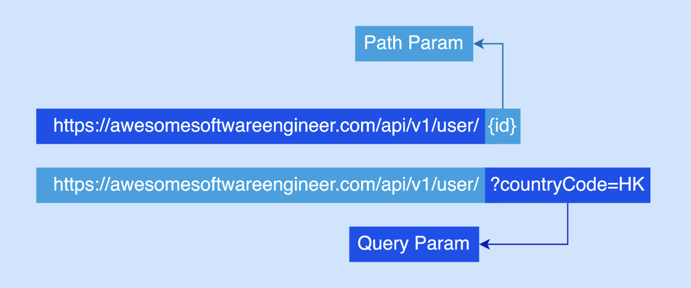
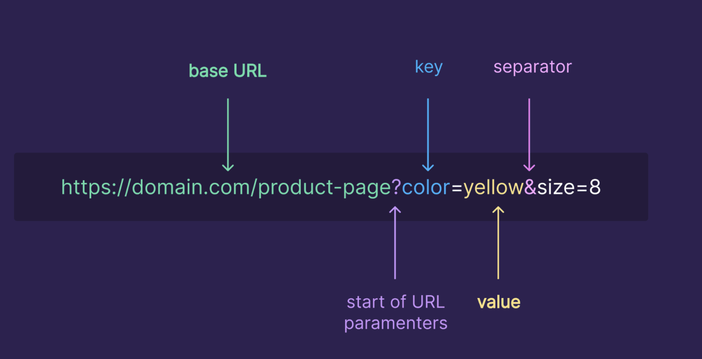
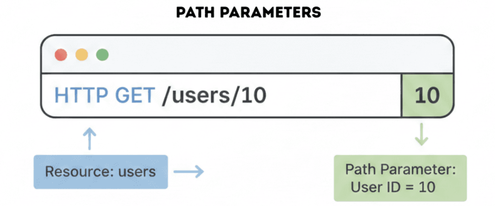
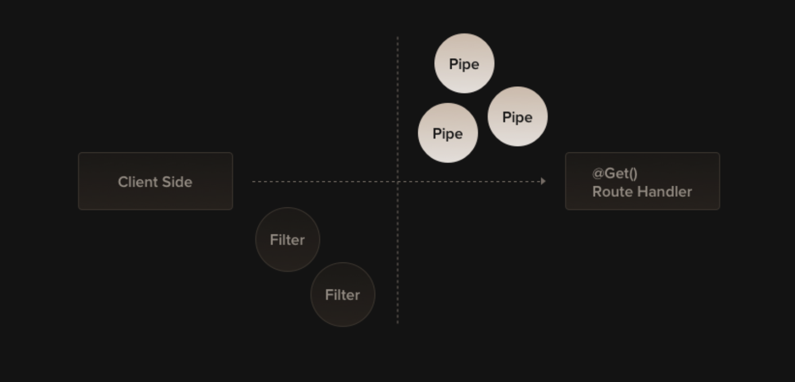

---
theme:
    override:
        code:
            #theme_name: "Monokai Extended Bright"
        default:
            colors:
                background: "10141c"
---
NestJs
===

<!-- new_line -->
<!-- new_line -->
<!-- new_line -->
Mitsiu Alejandro Carreño Sarabia
<!-- end_slide -->

# Course structure **Partial test**
- `2nd Partial = 30%`
- - Autoevaluation = 5%
- - Theorical evaluation = 40%
- - Practical evaluation = 55%
<!-- end_slide -->

`Agenda`    
├── Query params   
├── Route params      
├── Pipes        
└── Lab   

<!-- end_slide -->

# Query Params

Query parameters live after the ? and tell the server how to tailor the response.

Allows the user to provide extra information about the resource being requested.
<!-- end_slide -->

# Query Params

```ts
@Controller('product-page')
export class ProductController{
    @Get()
    getProduct(@Query('color') color:string, @Query('size') size:string):string[]{
        return ["client requested", color, size];
    }
}
```
<!-- end_slide -->

## Route Params


Are dynamic URL segments

Also allows the user to provide extra information about the resource being requested.
<!-- end_slide -->
## Route Params

Are defined with a colon (:)
```ts
@Controller('users')
export class UserController{
    @Get(':id')
    getUser(@Param('id') id:string): string {
        return "Requested id " + id;
    }
}
```
<!-- end_slide -->
### Pipes
> A pipe is a class annotated with the @Injectable() decorator, which implements the PipeTransform interface.



Pipes have two typical use cases:

- transformation: transform input data to the desired form (e.g., from string to integer)
- validation: evaluate input data and if valid, simply pass it through unchanged; otherwise, throw an exception
<!-- end_slide -->

### Pipes

Nest comes with several pipes available out-of-the-box:

<!-- column_layout: [1,1] -->
<!-- column: 0 -->
- ValidationPipe
- ParseIntPipe
- ParseFloatPipe
- ParseBoolPipe
- ParseArrayPipe
<!-- column: 1 -->
- ParseUUIDPipe
- ParseEnumPipe
- DefaultValuePipe
- ParseFilePipe
- ParseDatePipe
<!-- reset_layout -->

<!-- end_slide -->

### Pipes

```ts
@Controller('users')
export class UserController{
    @Get(':id')
    getUser(@Param('id', ParseIntPipe) id:number): number {
        return id + 2;
    }
}
```
<!-- end_slide -->
#### Lab
<!-- end_slide -->
