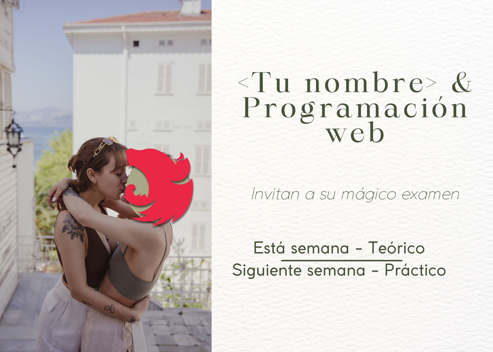
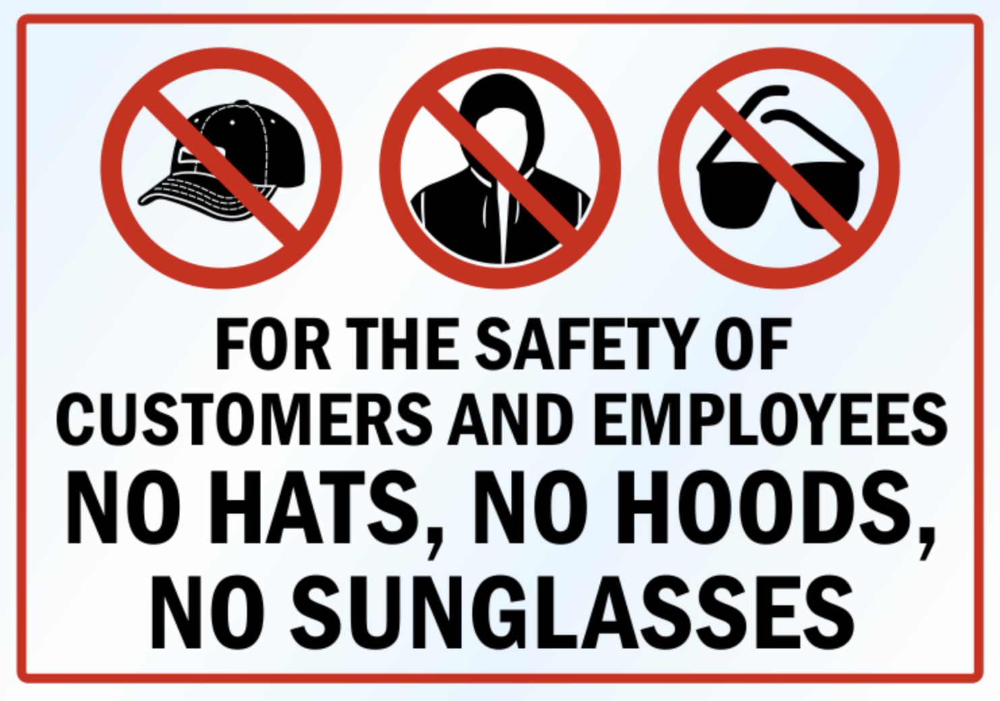
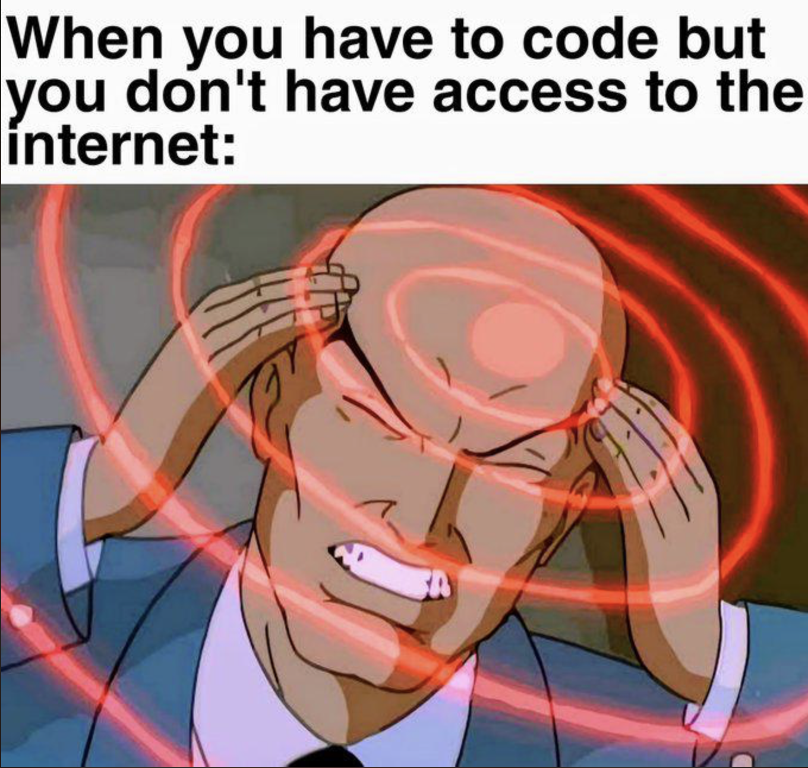
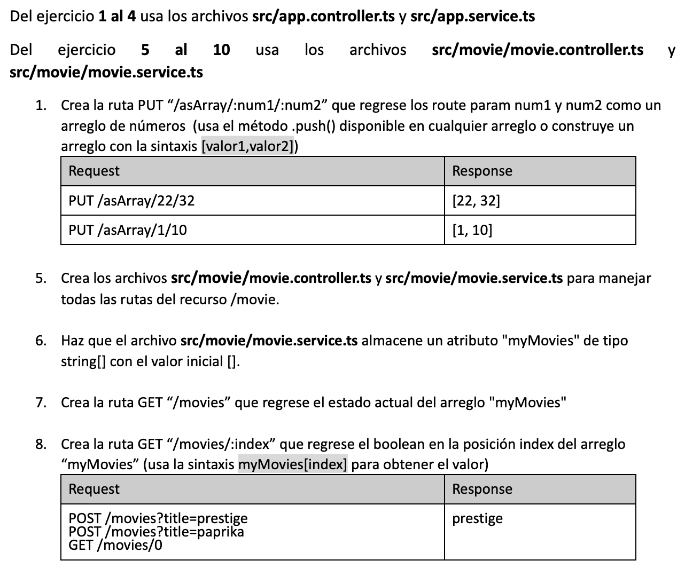
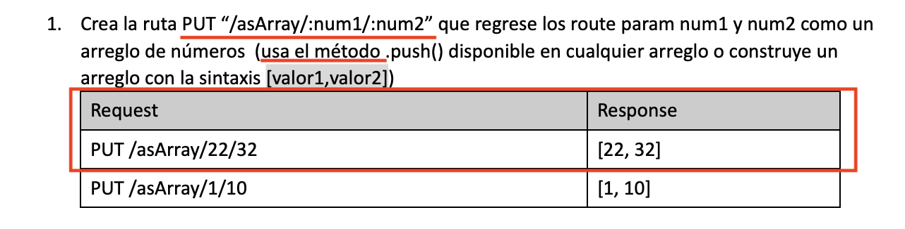
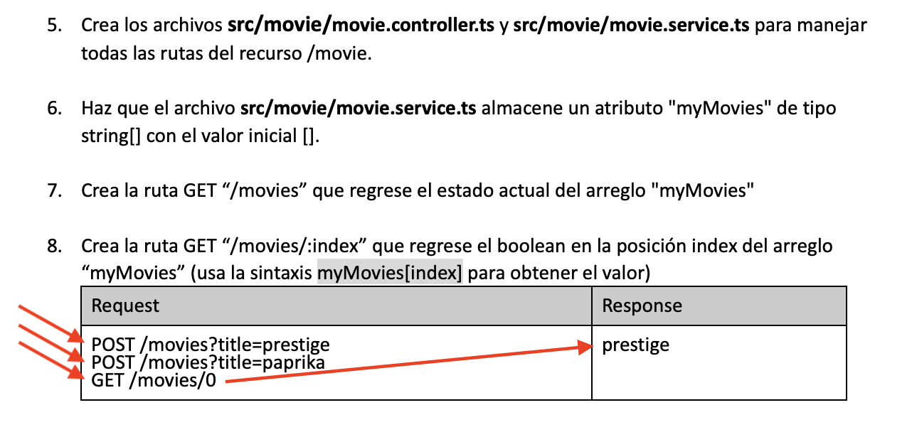
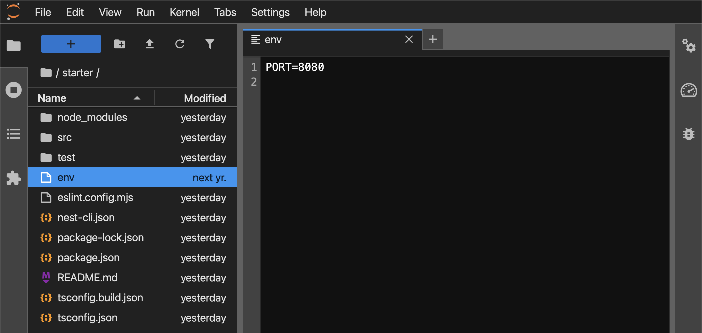
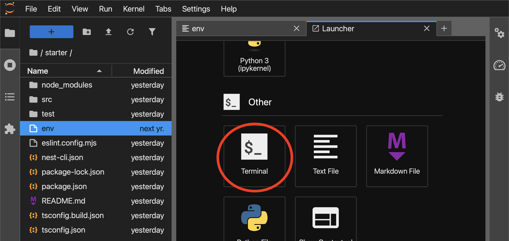
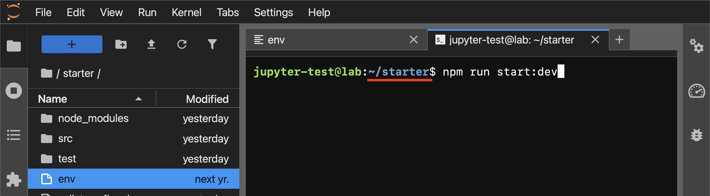
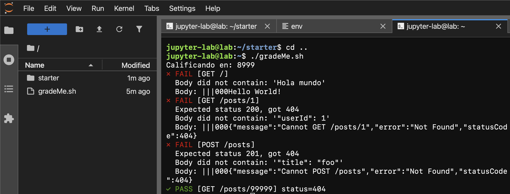

---
theme:
    override:
        code:
            #theme_name: "Monokai Extended Bright"
        default:
            colors:
                background: "10141c"
---

<!-- end_slide -->

<!-- end_slide -->
# Código de vestimenta 


<!-- end_slide -->
# Código de vestimenta 
- PROHIBIDO USAR SUDADERAS



<!-- end_slide -->

# Tenerte presente con computadora es nuestro mejor regalo.

- La computadora es escencial para realizar `la evalaución práctica.`


<!-- end_slide -->

# Tenerte presente con computadora es nuestro mejor regalo.

- La barra de tareas debe estar siempre visible durante `la evalaución práctica.`


<!-- end_slide -->

# Tenerte presente con computadora es nuestro mejor regalo.

- Recuerda que no habrá conexión a internet (postman) durante `la evalaución práctica.`



<!-- end_slide -->

# Posición

- En todo momento debes pegar tu cuerpo al escritorio con ambos pies en el suelo.


<!-- end_slide -->

# Mi trabajo NO ES:

<!-- end_slide -->


# Mi trabajo ES:

<!-- end_slide -->

# Ponderaciones
- `2° Parcial = 30%`
- - Autoevaluación = 5% (https://forms.gle/RxKHDzuxDXuewTRJ8)
- - Evaluación teórica = 40%
- - Evaluación práctica = 55%
<!-- end_slide -->

# Prep
Para su evaluación práctica deben dominar los siguientes temas:
- Atributos de clases 
```ts +line_numbers {2,5}
export class MovieService {
    movies : string[] = ['Spiderverse'];
    
    addMovie(newMovie:string): string[] {
        this.movies.push(newMovie);
        return this.movies;
    }
}
```
<!-- end_slide -->

# Prep
Para su evaluación práctica deben dominar los siguientes temas:

- If statements
```ts
    if(something == true){
        console.log('something es true');
    }else{
        console.log('something no es true');
    }
```
<!-- end_slide -->

# Prep
Para su evaluación práctica deben dominar los siguientes temas:

- Método \<array\>.push(\<nuevoElemento\>);
```ts
    let arreglo: boolean[] = [false];
    arreglo.push(true);
    console.log(arreglo) 
    // [false, true]
```
<!-- end_slide -->

# Prep
Para su evaluación práctica deben dominar los siguientes temas:

- Método \<array\>.includes(\<buscarElemento\>);
```ts
    let arreglo: string[] = ["Juan"];
    let existeMario : boolean = arreglo.includes('Mario');
    console.log(existeMario)
    // false
```
<!-- end_slide -->

# Prep
Para su evaluación práctica deben dominar los siguientes temas:

- Atributo \<array\>.length;
```ts
    let arreglo: number[] = [5,6,7];
    let cantElem: number = arreglo.length;
    console.log(cantElem)
    // 3
```
<!-- end_slide -->

# Prep
Para su evaluación práctica deben dominar los siguientes temas:

- Construir arreglos:
```ts
    let arr: number[] = [5,4,6];
    // o 
    return [5,4,6];
```
<!-- end_slide -->

# Prep
Para su evaluación práctica deben dominar los siguientes temas:

- Obtener datos de arreglos basado en posición:
```ts
    let arr: number[] = [5,4,6];

    let primerElem: number = arr[0];
    console.log(primerElem)
    // 5

    let segundoElem: number = arr[1];
    console.log(segundoElem)
    // 4
```
<!-- end_slide -->

# Prep
Para su evaluación práctica deben dominar los siguientes temas:

- Actualizar datos de arreglos basado en posición:
```ts
    let arr: number[] = [5,4,6];

    arr[0] = 10;
    console.log(arr) 
    // [10, 4, 6];

    arr[2] = -1;
    console.log(arr)
    // [10, 4, -1];
```
<!-- end_slide -->

# Prep
Para su evaluación práctica deben dominar los siguientes temas:

- Método \<string\>.toLowerCase();
```ts
    let mensaje: string = "HOLA";
    let susurro: string = mensaje.toLowerCase();
    console.log(susurro) 
    // "hola";
```
<!-- end_slide -->

# Prep
Para su evaluación práctica deben dominar los siguientes temas:

- Método \<string\>.toUpperCase();
```ts
    let mensaje: string = "hola";
    let grito: string = mensaje.toUpperCase();
    console.log(grito);
    // "HOLA";
```
<!-- end_slide -->

# Prep
Para su evaluación práctica deben dominar los siguientes temas:

- Operador modulo para detectar pares/impares
```ts {2}
function esPar(x:number):boolean{
    if(x % 2 == 0){
        return true;
    }
    return false;
}

console.log(esPar(21));
```
<!-- end_slide -->

# Prep
Para su evaluación práctica deben dominar los siguientes temas:
- Funciones
- Parámetros
- Clases
- Métodos
- Atributos
- Decoradores
<!-- end_slide -->

# Prep
Los siguientes temas `no forman parte de la evaluación práctica`:
- \<array\>.filter(cb);
- \<array\>.sort(cb);
- \<array\>.map(cb);

<!-- end_slide -->

# Prep
Los ejercicios del examen tienen esta nomenclatura:


<!-- end_slide -->

# Prep
Del ejercicio 1 al 4 usa los archivos **src/app.controller.ts** y **src/app.service.ts** 

Del ejercicio 5 al 10 usa los archivos **src/\<algo>/\<algo>.controller.ts** y **src/\<algo>/\<algo>.service.ts**


<!-- end_slide -->

# Prep

<!-- end_slide -->

# Prep

<!-- end_slide -->

<!-- jump_to_middle -->
## Jupyterhub
<!-- end_slide -->
## Jupyterhub

1. Cambiar el puerto en el archivo starter/env


<!-- end_slide -->

## Jupyterhub
2. Abrir nueva pestaña "Launcher" y elegir "Other -> Terminal"


<!-- end_slide -->

## Jupyterhub
3. En la ruta ~/starter correr el comando:
```bash
npm run start:dev
```


<!-- end_slide -->

## Jupyterhub
4. En la ruta ~ correr el comando:
```bash
./gradeMe.sh
```


<!-- end_slide -->

<!-- jump_to_middle -->
### Corruption hotline ⚖️📢
<!-- end_slide -->
### Corruption hotline ⚖️📢
1. Si tienes `sospechas` (no se requiere evidencia) de que algún alumno hará trampa en las evaluaciones, escribeme un correo a:

mitsiu.carreno@upa.edu.mx

<!-- pause -->
2. Durante las evaluaciones prestaré especial atención en los alumnos reportados.
<!-- new_line -->
<!-- pause -->
3. En caso de detectar trampas se otorgará una recompenza de `10 tokens (1 punto)` al/los alumno(s) que proveyeron las pistas.
<!-- new_line -->
Proceso anónimo 100% garantizado.
